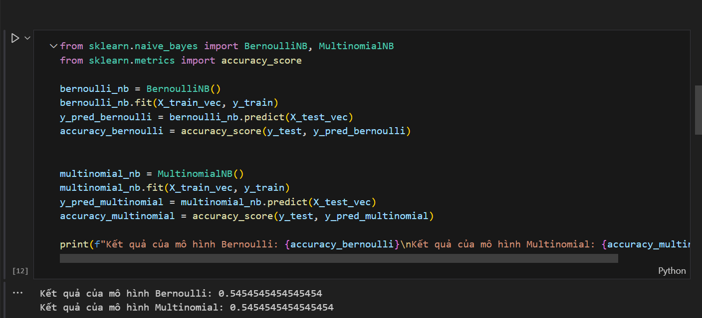

# Machine_learning
# CÂU 1:
1. Công nghệ sử dụng: Sử dụng thư viện pandas, numpy, sklearn.
2. Thuật toán sử dụng: Naive Bayes

Ta thấy được thuật toán Bernoulli Naive Bayes cho ra tỉ lệ là 0.54 và thuật toán Multinomial Naive Bayes là 0.54
Ta thấy 2 kết quả dù sử dụng 2 mô hình nhưng đều cùng kết quả 
# CÂU 2:
1. Công nghệ sử dụng: pandas, sklearn.
2. Thuật toán sử dụng: Naive_bayes

