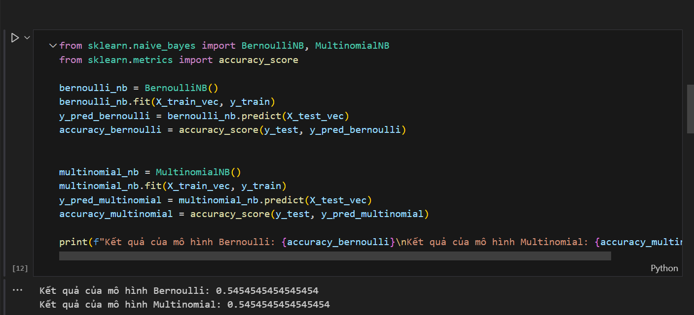

# Machine_learning
# CÂU 1:
1. Công nghệ sử dụng Sử dụng thư viện: pandas, numpy, sklearn.
2. Thuật toán sử dụng Naive Bayes
# Hình Ảnh KQ câu 1

# CÂU 2:
1. Công nghệ sử dụng: pandas, sklearn.
2. Thuật toán sử dụng: Naive_bayes
# Hình Ảnh KQ câu 2

